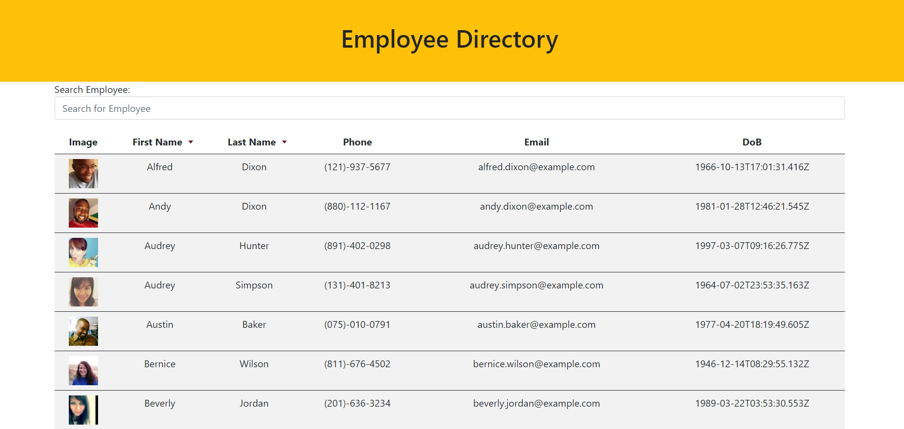

# Employee Directory

## Contents

1. [Technologies-Used](#Technologies-Used)
2. [Description](#Description)
3. [Deploy](#Link)
4. [Usage](#Usage)
5. [License](#License)
6. [Credits](#Credits)
7. [Contributing](#Contributing)
8. [Questions](#Questions)

## Technologies-Used

1. Javascript
2. Node.js
3. Node packages
   - axios
   - bootsrap
   - compression
4. React.js
5. HTML
6. CSS

## Description

- An Application that let you check all the employee in the company, search employee, sort them with name or last name to a-z or z-a.

## Deployed application link

- [Deployed Link](...)

## Usage

- User only needs to go to the deployed link, and look up for an employee.

- 

## License

- 

## Credits

- Created by Tolga Secme.

## Contributing

- No contributes.

##  Questions

- E-mail me for any questions [tolgasecme@icloud.com](mailto:tolgasecme@icloud.com)
- Also you can find me on Github [TolgaS92](https://github.com/TolgaS92).
